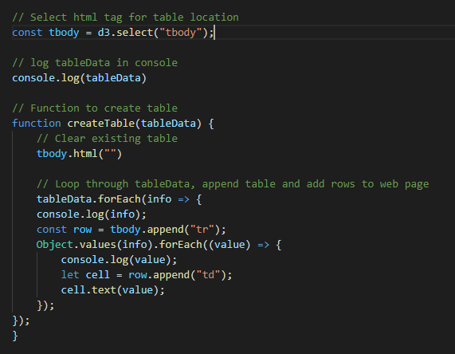

# UFO Sighting

- Wrote code that:
    - appends a table to the web page 

    

    - adds new rows of data for each UFO sighting

- Used a date form in HTML document and wrote JavaScript code that will listen for events and search through the date/time column to find rows that match user input.