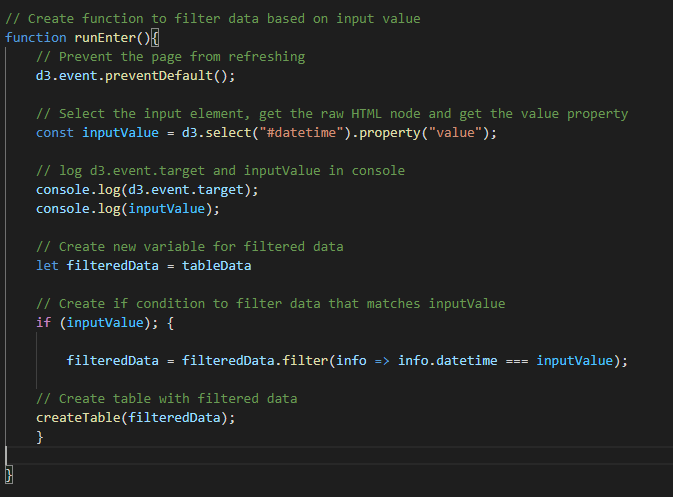
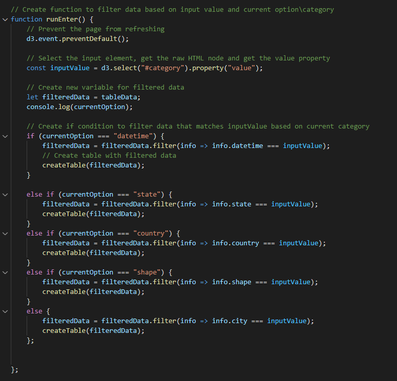
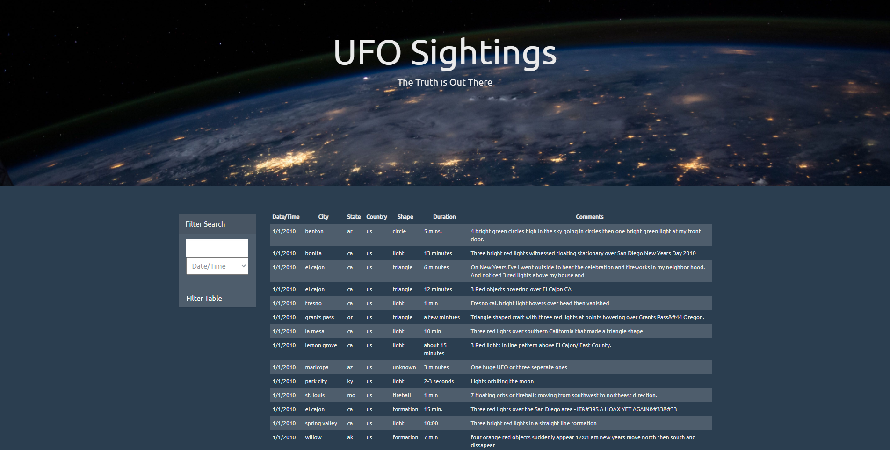

# UFO Sighting

- Wrote code that appends a table to the web page and adds new rows of data from UFO dataset for each UFO sighting.

- Used a date form in HTML document and wrote JavaScript code that will listen for events and search through the date/time column to find rows that match user input (UFO-Level-1).

- Created a dropdown menu (which contains date/time, city, state, country, shape) in html file and wrote JavaScript code so the user can search for UFO sightings using criteria listed in dropdown menu (UFO-Level-2).

